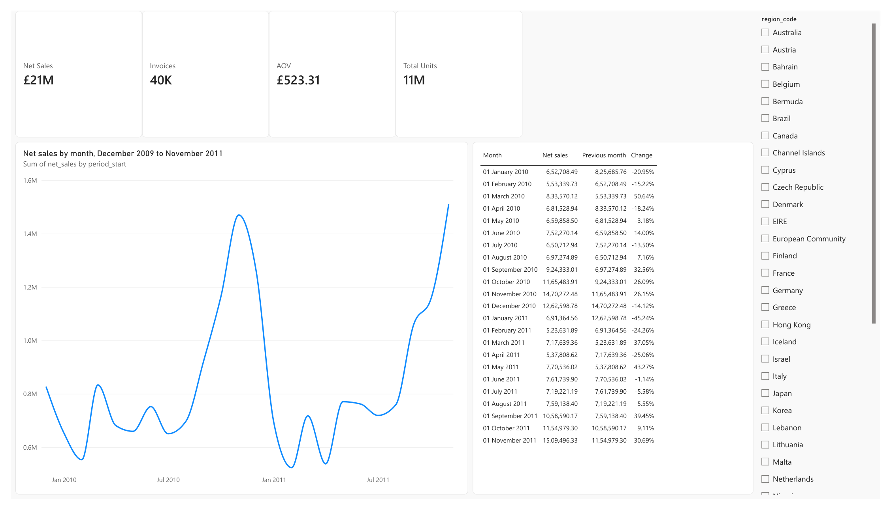
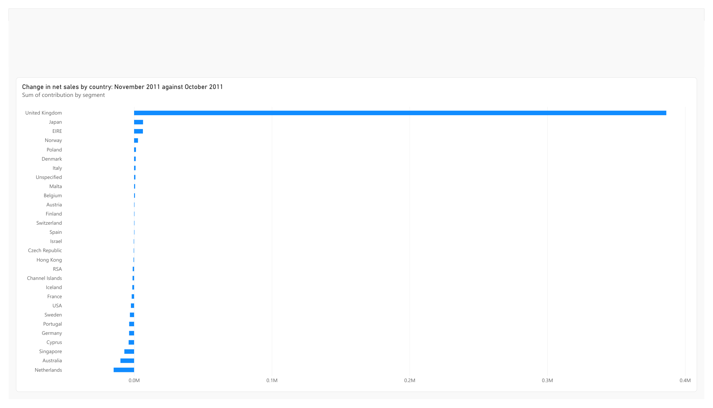
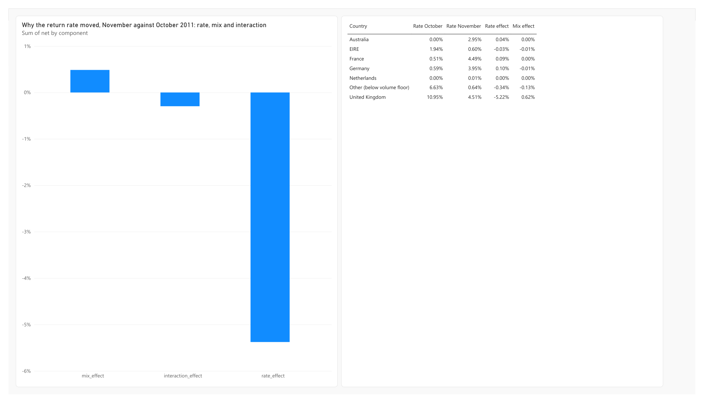
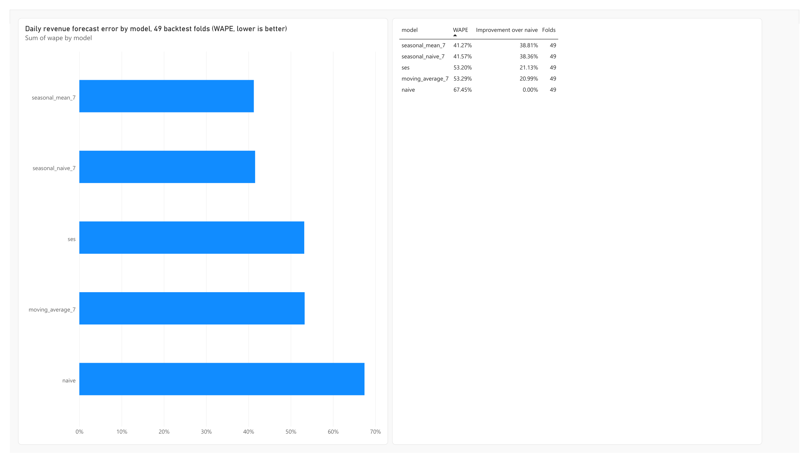

# Power BI on the RootSignal warehouse

The pipeline loads the cleaned model and the analysis results into PostgreSQL,
and this report reads them from there. It computes nothing the project has not
already computed and tested: revenue comes from the fact table, and the country
contributions, the rate and mix split, month-on-month change and forecast
accuracy come from report tables the pipeline writes.

| Overview | Drivers |
| --- | --- |
|  |  |
| **Returns** | **Forecast** |
|  |  |

## Open it

1. Fill the warehouse:
   ```bash
   docker compose up -d warehouse
   docker compose run --rm pipeline
   ```
2. Open `docs/RootSignal.pbit` in Power BI Desktop. It is a template: the
   report and model without data, so it asks for the connection and loads.
3. Credentials: **Database**, user `rootsignal`, password `rootsignal`. These
   belong to the local container in `docker-compose.yml`.
4. The container has no TLS certificate, so Power BI asks to connect without
   encryption: **OK**.

Loading a million sales lines takes about a minute. On a machine with 8 GB of
RAM, run the report and the Spark pipeline at different times; together they
exhaust Docker's memory.

## What is in it

**Overview.** Net sales, invoices, average order value and units as cards, with
a country slicer that filters them. Net sales by month, and a table of each
month against the one before, taken from `rpt_monthly_trend`.

**Drivers.** How much each country moved net sales between October and
November 2011, from `rpt_country_contribution`.

**Returns.** Why the return rate moved over the same two months, split into a
rate effect (countries returning a different share) and a mix effect (demand
moving toward countries that always return more), from
`rpt_return_rate_components` and `rpt_return_rate_split`. The rate effect
carries almost all of the movement.

**Forecast.** Backtested error of each daily revenue model against the naive
baseline, from `rpt_forecast_accuracy`. `seasonal_mean_7` is 38.8% better than
naive over 49 folds, the figure the README reports.

## Building it yourself

The template is the reliable route. To rebuild the report from an empty file:

- **Tables.** Get data → PostgreSQL database, server `localhost:5433`, database
  `rootsignal`, Import. Tables appear with the schema as a prefix, as
  `rootsignal fact_sales` and so on.
- **Relationships.** `fact_sales` to `dim_date` on `date`, to `dim_customer` on
  `customer_id` and to `dim_region` on `region_code`, each many to one, single
  direction. Leave the `rpt_` tables unconnected; they are finished results.
- **Not `dim_sku`, for now.** 172 product codes in the published data differ
  only in case (`15056BL` and `15056bl`, both "EDWARDIAN PARASOL BLACK").
  PostgreSQL keeps them apart, but Power BI compares text without case, finds
  duplicates, and offers only a many-to-many relationship. The fix belongs in
  the adapter, not the report.
- **Measures.** Power BI names ignore case, so a measure cannot be called
  `Units` next to a column called `units`:
  ```DAX
  Net Sales = SUM ( 'rootsignal fact_sales'[net_sales] )
  Total Units = SUM ( 'rootsignal fact_sales'[units] )
  Invoices = DISTINCTCOUNT ( 'rootsignal fact_sales'[order_id] )
  AOV = DIVIDE ( [Net Sales], [Invoices] )
  ```
  `Invoices` is a distinct count because one invoice lists several products.
  Expected totals: £20,972,594 net sales, 40,077 invoices, 11,438,460 units,
  £523.31 average order value.
- **Month-on-month change** comes from `rpt_monthly_trend` rather than
  `DATEADD`. `dim_date` holds only the days the retailer traded, and Power BI's
  time-intelligence functions assume an unbroken calendar.
- **Partial months** are already excluded from the monthly report tables; the
  data stops on 9 December 2011 and the pipeline drops that month.
- **Totals.** Turn off the total row on tables of rates and changes. Adding
  percentages across rows produces a number that means nothing.

A return rate is not a fill rate. Returns are customers sending goods back, not
a warehouse failing to ship.
